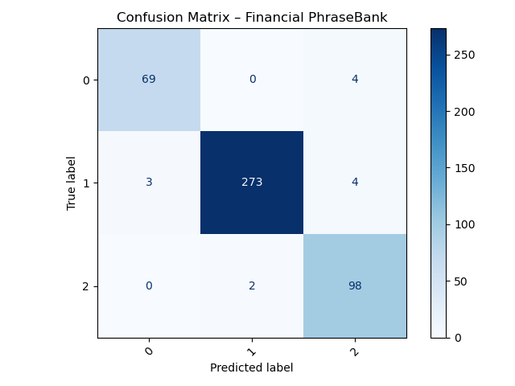

# Fine-Tuning DistilRoBERTa for Financial Sentiment Classification

## 1. Projektziel

Ziel dieses Mini-Projekts war das Fine-Tuning des vortrainierten Sprachmodells **DistilRoBERTa** auf den Datensatz *Financial PhraseBank (sentences_allagree)*, um die Stimmung von Finanztexten in drei Klassen zu klassifizieren: **positiv**, **neutral** und **negativ**.  
Das Projekt diente als praxisnahes Beispiel für die Anpassung eines Transformer-Modells an eine spezifische Domäne mit begrenzter Datenmenge.

---

## 2. Vorgehen und technische Umsetzung

Die Implementierung erfolgte vollständig in Python (VS Code, Conda-Umgebung).  
Zentrale Bibliotheken: `transformers`, `datasets`, `evaluate`, `scikit-learn`, `torch`.

**Schritte im Überblick:**
1. Laden und Splitten des Datensatzes (80/20) über `datasets.load_dataset()`  
2. Tokenisierung mit `AutoTokenizer` von *DistilRoBERTa* (`max_length=128`, Padding/Truncation aktiviert)  
3. Modellinitialisierung: `AutoModelForSequenceClassification(num_labels=3)`  
4. Training mit `Trainer` (3 Epochen, LR=5e-5, Batch=16/32, Weight Decay=0.01)  
5. Evaluierung mittels Accuracy, Macro-F1, Precision und Recall  
6. Visualisierung über Confusion-Matrix (`matplotlib` + `sklearn`)

Alle Skripte sind modular aufgebaut (`src/train.py`, `src/utils.py`) und reproduzierbar über die bereitgestellte `requirements.txt`.

---

## 3. Ergebnisse

Nach drei Trainingsdurchläufen auf CPU wurde eine **Accuracy von ca. 93 %** und ein **Macro-F1 von etwa 0.92** erreicht.  
Die Ergebnisse zeigen eine robuste Klassifikation bei gleichzeitig konservativer Einordnung unsicherer Fälle.

**Confusion-Matrix (Testdaten):**  


**Interpretation:**
- Die neutrale Klasse dominiert im Datensatz und wird nahezu perfekt erkannt.  
- Positive und negative Sätze werden ebenfalls zuverlässig klassifiziert.  
- Leichte Verwechslungen treten zwischen *neutral* und *positiv* auf – ein realistisches Muster, da Finanzformulierungen oft gemischt oder vorsichtig sind.  
- Das Modell zeigt eine leichte Tendenz zur Neutral-Klassifikation („konservative Bias“).  

Insgesamt stellt das Modell eine **stabile Baseline für Finanz-Sentiment-Analysen** dar und ist für Echtzeit- oder Batch-Anwendungen gut geeignet.

---

## 4. Herausforderungen & Optimierungspotenzial

- Begrenzte Trainingsdaten führen zu eingeschränkter Varianz in Formulierungen.  
- Modell tendiert zu neutralen Labels bei mehrdeutigen Sätzen.  
- Rechenzeit auf CPU limitiert (3 Epochen ≈ 10–15 min).  

**Potenzielle Verbesserungen:**
- Erhöhung von `max_length` auf 256 zur Erfassung längerer Kontexte  
- Feinjustierung von `learning_rate` und Epochenanzahl  
- Datenaugmentation oder Few-Shot-Ansätze für seltener vorkommende Sentiments  
- Vergleich mit Zero-Shot-Modellen (z. B. GPT- oder Flan-T5-Ansätze)

---

## 5. Fazit

Das Fine-Tuning demonstriert erfolgreich den kompletten Workflow eines domänenspezifischen NLP-Modells im Finanzkontext – von der Datenerfassung bis zur Evaluation.  
Die erreichten Ergebnisse sind konsistent, reproduzierbar und liefern eine tragfähige Grundlage für weiterführende Projekte im Bereich **Financial Text Intelligence**.

---

## 6. Projektstruktur

```
mini-fin-sentiment/
├─ src/
│  ├─ train.py
│  ├─ utils.py
├─ reports/
│  ├─ figs/confusion_matrix.png
│ 
├─ README.md
└─ requirements.txt
```

---

**Autor:** Carsten Hartmann  
**Modul:** M6 – KI-gestützte Anwendungen  
**Betreuer:** Weiterbildung Data Science & KI Expert  
**Datum:** Oktober 2025
